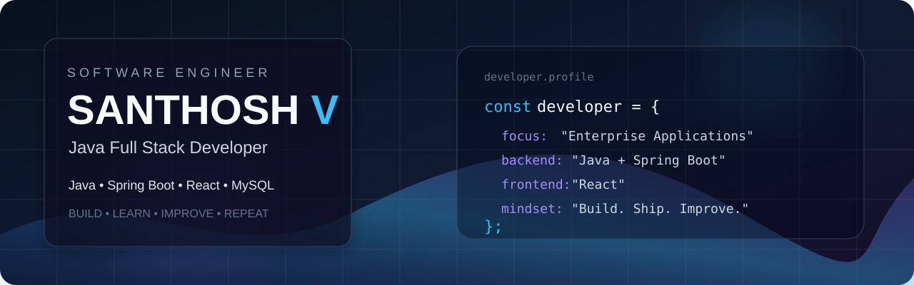

<div align="center">



# Hi, I'm Santhosh V 👋

### Java Full Stack Developer · Spring Boot · React · MySQL

Building scalable, maintainable applications and turning real-world problems into practical software solutions.

<p>
  <a href="https://santhosh125v.web.app/"></a>
  <a href="https://www.linkedin.com/in/santhoshv1205/"></a>
  <a href="mailto:santhoshv1205@gmail.com"></a>
</p>

</div>

---

## 👨‍💻 About Me

I'm **Santhosh V**, a Java Full Stack Developer focused on backend engineering, full-stack application development, REST APIs, and enterprise-oriented software systems.

- ☕ Strong focus on **Java, Spring & Spring Boot**
- ⚛️ Building responsive frontends with **React.js**
- 🔗 Designing and consuming **REST APIs & microservices**
- 🗄️ Working with **MySQL, Hibernate & JPA**
- 🧪 Practicing automated testing with **JUnit 5 & Mockito**
- 🔧 Using **Git, GitHub, Maven & Postman** in development workflows
- 🏗️ Interested in clean architecture, maintainable code and production-ready engineering

---

## 🛠️ Tech Stack

<div align="center">

### Languages


### Backend


`Spring Boot` · `REST APIs` · `Microservices` · `JPA`

### Frontend


### Database & Tools


</div>

---

## 🚀 Featured Projects

### 🏦 [MicroLend — NBFC Lending Management Platform](https://github.com/Santhoshv1205/Microlend---NBFC)

Enterprise-oriented microfinance/NBFC platform covering borrower onboarding, KYC, centre and group management, loan origination, sanction, disbursement, EMI schedules, collections, delinquency management, notifications, audit logging and portfolio analytics.

**Stack:** Java 21 · Spring Boot · Spring Security · JPA/Hibernate · React · MySQL · JWT · OpenAPI

### 🎓 [RMK ZapOut — Smart Gate Pass & On-Duty System](https://github.com/Santhoshv1205/RMK-ZapOut)

Digital campus authorization platform with role-based approval workflows, QR-based gate verification, request tracking, notifications, audit logs and dedicated dashboards for students and campus staff.

**Stack:** React · Vite · Tailwind CSS · Node.js · Express · MySQL · QR Code

🌐 **[Live Demo](https://rmkzapout.web.app/)**

### 🌐 [Santhosh V Portfolio](https://github.com/Santhoshv1205/Santhosh-V-portfolio)

Modern software developer portfolio focused on projects, experience, research and interactive presentation.

**Stack:** React · Vite · Tailwind CSS · Framer Motion

🌐 **[Live Portfolio](https://santhosh125v.web.app/)**

### 🧠 [HSE-FLS — Human Stress–Environment Feedback Loop System](https://github.com/Santhoshv1205/HSE-FLS)

IoT prototype combining ESP32 and physiological sensors to monitor stress-related signals and provide environmental feedback through automated fan control.

**Stack:** ESP32 · IoT · HRV · GSR · Skin Temperature · React · JavaScript

🌐 **[Live Demo](https://hse-fls.web.app/)**

### 🤖 [Human Tracking Bot Using Sensor Fusion](https://github.com/Santhoshv1205/Human-Tracking-Bot-Using-Sensor-Fusion)

Sensor-fusion based tracking project exploring robotics, sensing and real-time movement detection.

---

## 💼 Experience

### Cognizant Technology Solutions

**Programmer Analyst Trainee (PAT)** · **April 2026 – August 2026** · Coimbatore, Tamil Nadu

Worked in a Java Full Stack development environment with focus on enterprise application engineering and the **MicroLend** project.

**Technology focus:** Java 21 · Spring Boot · React · REST APIs · MySQL · Microservices · JUnit 5 · Mockito · Maven · Git

---

## 📚 Research & Publication

### RMK ZapOut

**RMK Zap Out: A Fully Digital Role-Based Workflow System for Campus Authorization Management**

📄 **ICDCA 2026 — IEEE publication**

The work presents a role-based digital workflow for campus authorization, combining multi-level approvals, QR verification and secure gate-exit management.

---

## 📊 GitHub Activity

<div align="center">


</div>

---

## 🎯 Current Focus

```text
Java Backend Engineering      ███████████████████░  95%
Spring Boot & REST APIs       ██████████████████░░  90%
React Full Stack              █████████████████░░░  85%
Microservices                 ████████████████░░░░  80%
Testing & Clean Code          ███████████████░░░░░  75%
Cloud & DevOps                ████████████░░░░░░░░  60%
```

---

## 🤝 Connect With Me

<div align="center">

<a href="https://santhosh125v.web.app/">Portfolio</a> ·
<a href="https://www.linkedin.com/in/santhoshv1205/">LinkedIn</a> ·
<a href="mailto:santhoshv1205@gmail.com">Email</a>

<br/><br/>

**Build · Learn · Improve · Repeat**

</div>

---

<div align="center">

<sub>Designed and maintained by <b>Santhosh V</b> · Java Full Stack Developer</sub>

</div>
